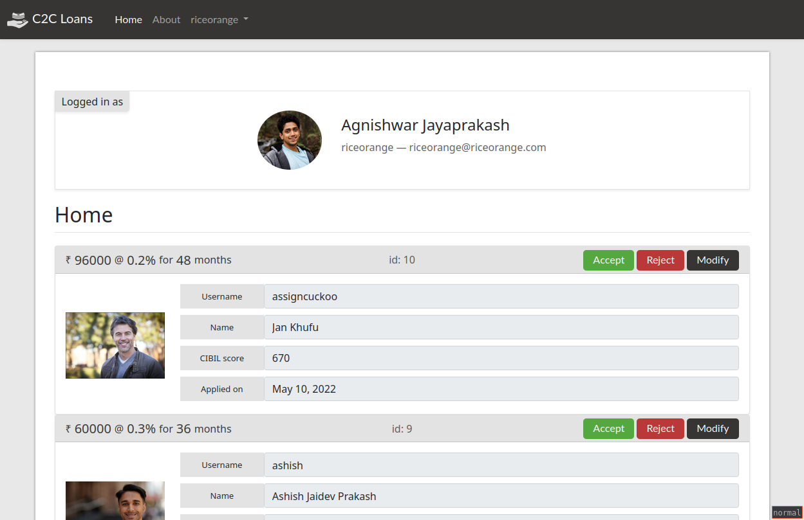

<p align="center">
  
  <br>
  <a href="https://www.codefactor.io/repository/github/bitgato/c2cloan"></a>
</p>
<h1 align="center">c2cloan</h1>
<p align="center">
A customer-to-customer loan providing web application.
<br>
https://c2cloan.herokuapp.com
</p>
<br>
Sign up and apply for a loan that other users can see. Other users have choices
for accepting, rejecting or modifiying your loan application. If you modify an
application and offer it, the original applicant has the option to
accept/reject the new terms.

### screenshot
<p align="center">
  
</p>

### tools used
* Python + Django
* Bootstrap
* Heroku
* Git

See `requirements.txt` for python libraries used

### features
* Login with either Google OAuth or username/password
* Profile with provided name, email, custom profile picture, bank details, CTC
* Option to upload Aadhaar, PAN and multiple Salary slips (in image format)
* Apply for loan which gets displayed on the front page of the website
* Accept/Reject/Modify other loan applications
* Modified loan offer shown on profile page
* Accepted offer disappears from unrelated user pages

### running
Clone this repo. Then run the following commands. The `SECRET_KEY` required
for django has been omitted from the settings file and can instead be provided
through an environment variable. Make sure your environment variable has a
`SECRET_KEY` defined, both locally and if deployed remotely.
```bash
$ pip install -r requirements.txt
$ python manage.py runserver
````

### authors
Written by Adnan Aslam ([bitgato](https://github.com/bitgato)) for
[flipr](https://flipr.ai) 2022 Hackathon

### license
This project is released under the GNU GPL v3 license
